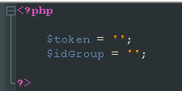
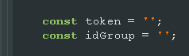

# Magic Clothes Shop

## Установка
Для работы требуется сервер, который поддерживает *PHP*  
Также необходимо установить все файлы в необходимую директорию  

В файлах:  
* articles.php 
* index.php 
* products.php  

надо вставить свой токен от лица пользователя и идентификатор группы в численном значении, где он является администратором  
Получить токен можно по ссылке: [Получение токена пользователя](https://oauth.vk.com/authorize?client_id=2685278&scope=notify,photos,friends,audio,video,notes,pages,docs,status,questions,offers,wall,groups,messages,notifications,stats,ads,offline&redirect_uri=http://api.vk.com/blank.html&display=page&response_type=token&callback=callbackFunc "Получение токена")  
Идентификатор группы можно найти в основных настройках группы:

Теперь в указанных файлах PHP и JS, нужно в переменные `token` и `idGroup` вставить значения  

>Токен и идентификатор группы нужен для того, чтобы с помощью VK API выгружать новости и катологи с товарами

## Стартовая страница
На стартовой странице можно встретить 1 слайдер
  
Изменить его можно в коде файла *index.php*  
  
### Раздел *Новые товары*
Раздел **Новые товары** формируется автоматически, исходя из последнего добавленного товара в группе ВКонтакте  
### Раздел *Что мы делаем?*
Раздел **Что мы делаем?** можно изменить в файле *index.php*  
### Раздел *Статьи*
Раздел **Статьи** также формируется автоматически, как и раздел *Новые товары*  
Статьи берутся со стены из группы во ВКонтакте  

## Каталог
Раздел каталог формируется автоматически. путём получения данных из ВКонтакте  
*Каталог* - это *подборки товаров* группы во ВКонтакте  
При нажатии на один из каталогов, отобразится список товаров, которые относятся к данной подборке
***
При нажатии на один из товаров, вас перекинет на карточку этого товара во ВКонтакте
***
Статьи также, как и на главной странице, берутся со стены группы во ВКонтакте

## Статьи
Статьи берутся со стены группы во ВКонтакте

## Контакты
Изменить данные на свои можно в файле *aboutUs.php*

## Проект в действии
Ссылка на рабочий проект: [click](https://edgesection.000webhostapp.com/ "рабочий проект")
